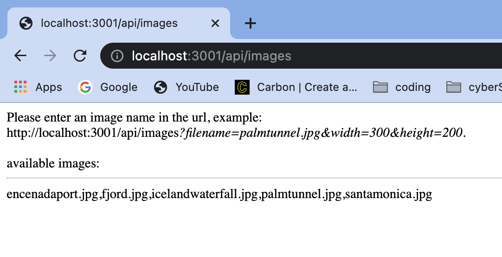
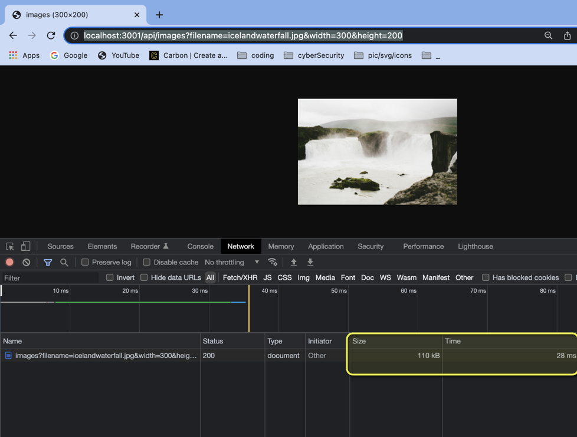
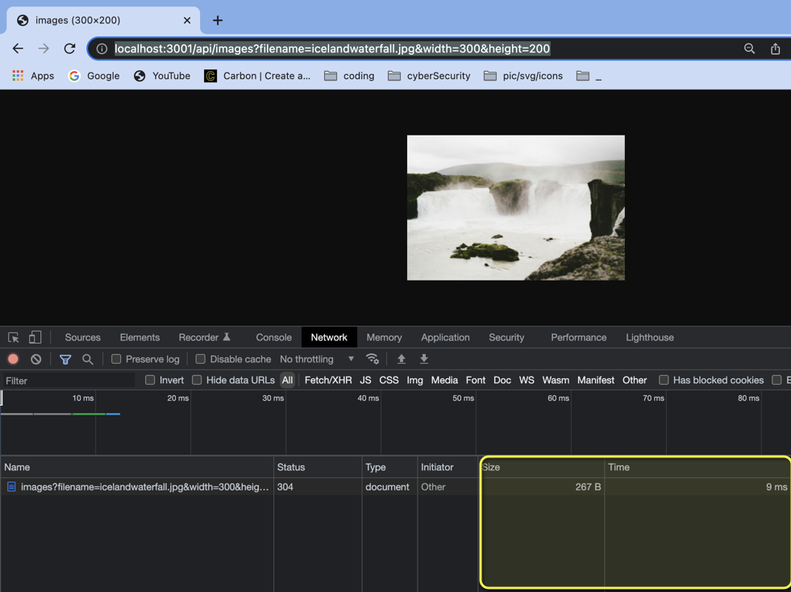

# image_process_api


Designing an API for image processing that
allows the user to visit a url and using url parameters {filename, width, height} to resize
the image based on the parameters provided. Upon viewing
an image that’s already been resized, a cached image will be
served. This is the core functionality seen in placeholder image
websites and can be implemented with a frontend to better
serve appropriately sized images.

### Installation

```sh
$ cd image_process_api
$ npm install
$ npm run start
```

## Example:

Go to the /api/images endpoint to view the available images.
Add the parameters as following:
filename - choose any file name in the assets/full folder
width - resized width.
height - resized height.

The expected url will be something like


```bash
"http://localhost:3001/api/images?filename=fjord.jpg&width=300&height=200"
```
All resized images can be find in the assets/thump folder.


# Overview:


#### Images endpoint



#### Image first Call before cache

Notice the size and time


#### Refresh the page

size and time got reduced. Image retrieved from cache memory
